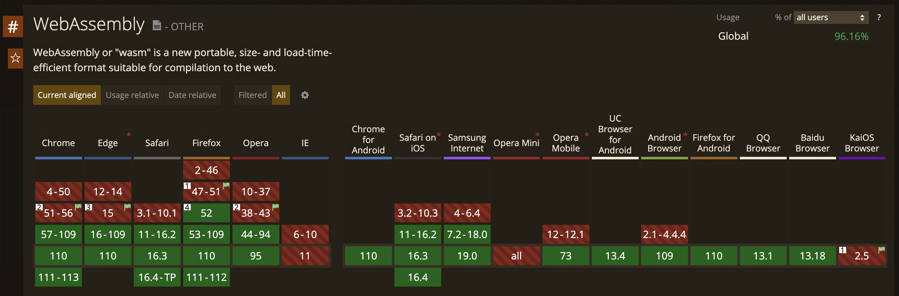

### Intro
## WASM / WASI
### and more

> <small>canzheng @2023 Spring</small>

---

## Table of Content

- What
    - What's wasm
- Why
    - Why we use wasm
    - Why we use wasi
- How
    - wasm in Web Development
    - wasm in CLI
    - wasm in Integration
    - wasm in Cloud Computing

---

# WASM

> WebAssembly

---

## History & Why

| Date | Tech | Vendor |
| - | - | - |
| 1995 | JavaScript | Netscape |
| 1997 | ECMAScript | Netscape |
| 2011 | Google Native Client (NaCl) | Google |
| 2012 | ASM.js | Mozilla |
| 2015 | WebAssembly | W3C |

--

### JavaScript / ECMAScript

--

### Google Native Client (NaCl)

--

### ASM.js

--

### WebAssembly

- Assembly 汇编
- WebAssembly 在 Web 中使用的汇编
- WebAssembly System Interface (WASI)

---

## At a glance

> Key Features

- two formats
    - binary-code format
    - corresponding text format
- high performance
- portable
- open standard

--

### Binary-Code Format

--

### Text Format

--

### High Performance

--

### Portable

---

## A "Hello World" app

--

### develop WASM by ...

--

### by Hand

--

### by C/C++

--

### by Rust

--

### by Golang

---

## WASM in Web Development

--

### Web Browser

--

### Full Stack by Rust

--

### MiniProgram in WeChat

---

## WASM in CLI

--

### Wasmtime

--

### Wasmer

---

## WASM in Integration

--

### in Rust

--

### in Java

--

### in Golang

---

## WASM in Cloud Computing

--

### in Docker

--

### in Kubernetes

--

### in Service Mesh

---

## Thanks

