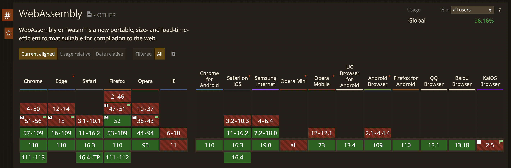
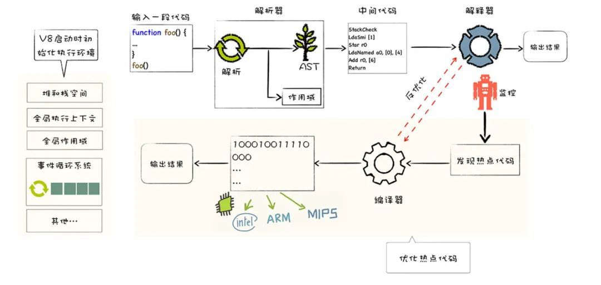
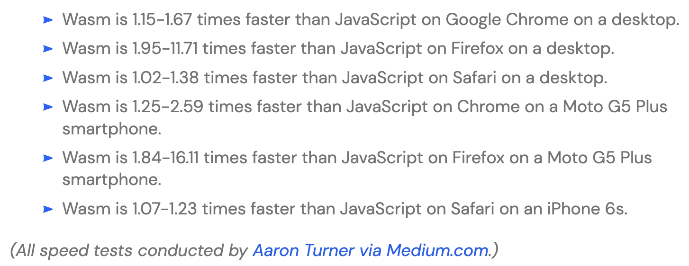

### Intro of
## WebAssembly
#### (aka. WASM)

> <small>canzheng @2023 Spring</small>

---

## Table of Content

- What
    - What's wasm

- Why
    - Why we use wasm
    - Why we use wasi

- How
    - wasm in Web Development
    - wasm beyond Web Development
    - wasm in Integration
    - wasm in Cloud Computing

---

# WASM

> WebAssembly



---

## History

| Date | Tech | Vendor |
| - | - | - |
| 1995 | JavaScript | Netscape |
| 1997 | ECMAScript | Netscape |
| 2011 | Google Native Client (NaCl) | Google |
| 2012 | ASM.js | Mozilla |
| 2015 | WebAssembly | W3C |

--

### JavaScript / ECMAScript

<div class="r-stack">
    
    <div class="fragment r-fit-text fade-in-then-out" data-fragment-index="0">
        <p>Performance ???</p>
    </div>
    
</div>

--

### Google Native Client (NaCl)

ref: [wikipedia](https://en.wikipedia.org/wiki/Google_Native_Client)

- 由谷歌所发起的开放源代码计划，采用 BSD 许可证。

- 采用沙盒技术，让 Intel x86、ARM 或 MIPS 子集的机器代码直接在沙盒上运行。

- 能够从浏览器直接运行程序机器代码，独立于用户的操作系统之外，使 Web 应用程序可以用接近于机器代码运作的速度来执行，同时兼顾安全性。

--

### ASM.js

ref: [wikipedia](https://zh.wikipedia.org/zh-cn/Asm.js) / [guide](https://www.ruanyifeng.com/blog/2017/09/asmjs_emscripten.html)

- asm.js 是一个中间语言，设计目的是使采用C等编程语言编写的计算机软件可运行为网络应用程序，同时性能特征明显优于标准 JavaScript。

- asm.js 包括一个 JavaScript 的严格子集，其中的代码采用具有手动内存管理的静态类型语言编写，代码使用一个源代码至源代码编译器翻译。

--

### ASM.js features

- 两大语法特点
    - 只有两种基础数据类型：int32, float64
    - 没有垃圾回收机制

- 常用开发方法
    - C/C++ ⇒ LLVM ==> LLVM IR ⇒ Emscripten ⇒ asm.js

--

### WebAssembly

ref: [wikipedia](https://en.wikipedia.org/wiki/WebAssembly) / [spec](https://webassembly.github.io/spec/core/intro/index.html) / [mdn](https://developer.mozilla.org/zh-CN/docs/orphaned/WebAssembly)

- Assembly == 汇编

- WebAssembly 在 Web 中使用的（类）汇编

- aka. WASM

---

# At a glance

---

## Goals

- Be fast, efficient, and portable
    - 以接近本地速度运行
- Be readable and debuggable
    - 允许通过手工来写代码，看代码以及调试代码
- Keep secure
    - 被限制运行在一个安全的沙箱执行环境中，遵循浏览器的安全策略
- Don't break the web
    - 与其他网络技术和谐共处并保持向后兼容

--

## Key Features

- a few value types
    - i32 / i64 / f32 / f64 / v128

- two file formats
    - binary format <small>(*.wasm)</small>
    - text format <small>(*.wat)</small>

- linear memory

- high performance

- portable & secure

--

### Binary Format

ref: [guide](https://juejin.cn/post/6844904062148689933)

```rust
struct Module {
    magic: u32,             // 魔法数 \0asm
    version: u32,           // 版本号，小端序 0b0000_0001
    sections: Section[],    // 段
}
```

```rust
enum Section {
    Custom = 0, // 自定义段，可以存放调试信息、第三方扩展信息等
    Type,       // 类型段，存放函数的类型信息/签名
    Import,     // 导入段，存储导入到运行上下文的函数、表、内存和全局变量
    Function,   // 函数段，按顺序存储内部函数的签名在类型段中的索引
    Table,      // 符号表段，用于动态链接/间接调用相关能力
    Memory,     // 内存段，存放内存（堆、共享内存、相关约束信息
    Global,     // 全局变量段，存储内部（非导入）的全局变量信息
    Export,     // 导出段，存储可以导出到外部的函数、表、内存和全局变量
    Start,      // 起始段，只包含一个起始函数索引，类 main 函数
    Element,    // 符号元素段，配合 Table 指定符号位置
    Code,       // 代码段，存放函数的局部变量信息和字节码
    Data,       // 数据段，存放内存初始化信息
    DataCount,  // 数据计数段，存放 Data 段内的数据片段数量
}
```

--

### Text Format

Example #1
```
(module
  (func $add (param $lhs i32) (param $rhs i32) (result i32)
    get_local $lhs
    get_local $rhs
    i32.add)
  (export "add" (func $add))
)
```

Example #2
```
(module
  (import "console" "log" (func $log (param i32)))
  (func (export "logIt")
    i32.const 13
    call $log))
```

--

### Linear Memory

> Full Memory
>> Page (64k)
>>
>
>> Page (64k)
>>
>
>> Page (64k)

--

### High Performance

ref: https://takahirox.github.io/WebAssembly-benchmark/

<div class="r-stack">
    
    <div class="fragment r-fit-text fade-in-then-out" data-fragment-index="0">
        <p>较适合：大数据量的计算</p>
        <p>不适合：跟界面 / JS 有很多交互的逻辑</p>
    </div>
</div>

--

### Portable & Secure

| App1 | App2 | ... |
| - | - | - |
| WASM VM | 虚拟机 | ... |
| HOST 宿主机（x86 / ARM / ...） |||

> 二进制/文本格式皆可跨平台

---

# in Web Dev

---

## a "Hello World"

<p class="fragment fade-in">
Q1: 选择开发语言
</p>
<p class="fragment fade-in">
by Hand
<span class="fragment">/ by C/C++</span>
<span class="fragment">/ by <span class="fragment highlight-red">Rust</span></span> 
</p>
<p class="fragment fade-in">
Q2: 开发框架
</p>
<p class="fragment fade-in">
<span style="color:red">NONE</span>
</p>
<p class="fragment fade-in">
<small>ref: <a href="https://rustwasm.github.io/docs/book/">https://rustwasm.github.io/docs/book/</a></small>
</p>

--

### Dev Env

```bash
# Install Rust
curl --proto '=https' --tlsv1.2 -sSf https://sh.rustup.rs | sh

# Add support of WebAssembly
rustup target add wasm32-unknown-unknown

# Install NodeJS
brew install node
```

--

### Try It

```bash
# To project
cd 00-hello-world
```

```bash
# Open in VSCode
code .
```

```bash
# Launch Web App
npm install
npm run serve
```

```bash
# View
open http://127.0.0.1:8080
```

--

### In Rust

```rust
use wasm_bindgen::prelude::*;

#[wasm_bindgen]
extern {
    fn alert(s: &str);        // 将外部的 alert 函数引入 Rust 环境
}

#[wasm_bindgen]
pub fn greet(who: String) {   // 定义 greet 函数，并导出
    alert(format!("Hello {who}!").as_str());    // 调用 alert
}
```

--

### In JavaScript

#### index.js
```javascript
const wasm = import('./pkg');        // 引入 .pkg 下的 WebAssembly

wasm
  .then(m => m.greet('World!'))      // 调用 greet 函数
  .catch(console.error);             // 处理 wasm 加载错误的情况
```

#### webpack.config.js
```javascript
new WasmPackPlugin({      // 添加对于 WebAssembly / WasmPack 的支持
    crateDirectory: path.resolve(__dirname, ".")
})
```

---

## a "TODO List"

<p class="fragment fade-in">
>>  全栈 Rust  <<
</p>

<p class="fragment fade-in">
ref: <a href="https://developer.mozilla.org/en-US/docs/Learn/Tools_and_testing/Client-side_JavaScript_frameworks/React_todo_list_beginning">clone from</a>
</p>

--

### Dev Env

```bash
cargo install --locked trunk
```

--

### Try It

```bash
# To project
cd 01-todo-list
```

```bash
# Open in VSCode
code .
```

```bash
# Launch Web App
trunk serve
```

```bash
# View
open http://127.0.0.1:8080
```

--

### Yew

基于纯 Rust 的前端开发框架

```html
html! {
    <>
        <div>
            <h1>{ "Hello" }</h1>
            <Greeting name={ "World" }>
                <span>{ "on Earth" }</span>
            </Greeting>
            <button onclick={onclick}>{ "Click Me" }</button>
        </div>
        <div>
            <Footer />
        </div>
    </>
}
```

--

### Component

React
```javascript
# 类组件
class MyComponent extends React.Component<Props> {}

# 方法组件
const MyFunc: React.FC<Props> = (props) => { ... }
```

Yew
```rust
#[function_component(Foo)]
fn foo() -> Html { ... }
```

--

### Hooks

| | React | Yew |
| - | - | - |
| Basic |||
| | useState | use_state / use_state_eq |
| | useEffect | use_effect / use_effect_with_deps |
| | useContext | use_context |
| Additional |||
| | useReducer | use_reducer / use_reducer_eq |
| | useCallback | use_callback |
| | useMemo | use_memo |
| | useRef | use_node_ref / use_mut_ref |
| | | use_force_update |

--

### Events

```rust
let onchange = Callback::from(move |e: Event| {
    if let Some(element) = e.target_dyn_into::<HtmlInputElement>() {
        web_sys::console::log_1(&element.value());
    }
});

let onclick = Callback::from(move |e: MouseEvent| {
    e.prevent_default();
});

html! {
    <>
        <input {onchange} />
        <button {onclick}>{ "Click Me" }</button>
    </>
}
```

---

## WASM in WeChat
### MiniProgram

--

### WXWebAssembly

- WXWebAssembly 类似于 Web 标准 WebAssembly，能够在一定程度上提高小程序的性能。

- 从基础库 v2.13.0 开始，小程序可以在全局访问并使用 WXWebAssembly 对象。

- 从基础库 v2.15.0 开始，小程序支持在 Worker 内使用 WXWebAssembly。

- 小程序插件从基础库 v2.18.1 开始支持 WXWebAssembly。

- 从微信 8.0.25 开始支持 SIMD 特性。

---

# beyond
# Web Dev

---

## Embedding Interfaces

> ref: https://webassembly.org/specs/

- JavaScript API{.fragment}
    - 访问 JavaScript 相关数据结构和对象
    - 与 JavaScript 相关上下文进行交互

- Web API{.fragment}
    - 扩展 JavaScript 以提供与浏览器交互的能力

- WASI API{.fragment}
    - 提供了在 Web 之外访问标准化系统接口的能力
    - 包括文件、网络、时钟、随机数等

--

### WASI

WebAssembly System Interface

>>> WASM App
>>
>> WASI Runtime
>
> Host OS{.fragment}

--

### Wasmtime

Install
```bash
curl https://wasmtime.dev/install.sh -sSf | bash
```

Coding
```rust
// hello.rs
fn main() {
    println!("Hello, world!");
}
```

Build
```bash
rustup target add wasm32-wasi
rustc hello.rs --target wasm32-wasi
```

Run
```bash
wasmtime hello.wasm
Hello, world!
```

--

### Wasmer

Install
```bash
curl https://get.wasmer.io -sSfL | sh
```

Run
```bash
wasmer hello.wasm
```

--

### Embed WASM into ...

<br/>

>>> WASM Module
>>
>> WASM Runtime
>
> Java / Golang / ...{.fragment}

<br/>

<p class="fragment">
eg: <a href="https://github.com/wasmerio/wasmer-java">wasmer-java</a>, <a href="https://github.com/wasmerio/wasmer-go">wasmer-go</a>, <a href="https://github.com/wasmerio/wasmer-python">wasmer-python</a>
</p>

---

# in Cloud Computing

---

## in Docker

--

## in Kubernetes

--

## in Service Mesh

---

# Thanks

> 除了 AI，也要学 Rust 了么？

