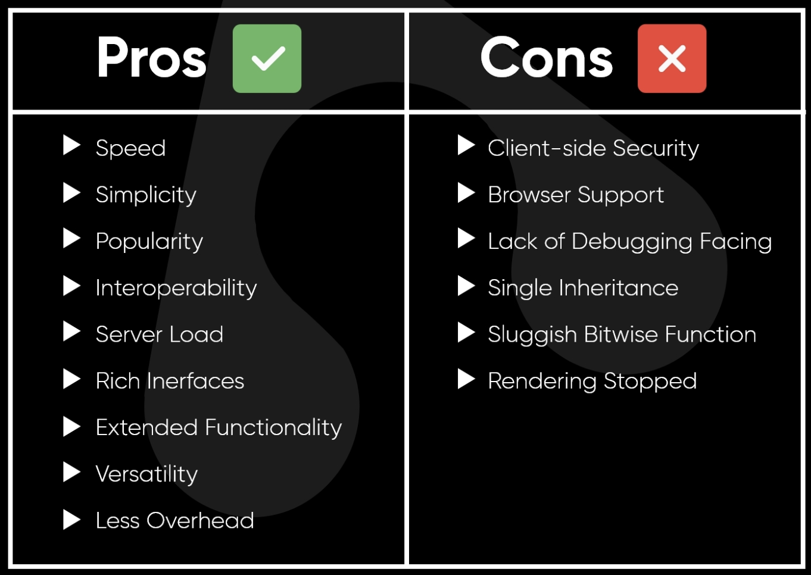

### Intro
## WASM / WASI
### and more

> <small>canzheng @2023 Spring</small>

---

## Table of Content

- What
    - What's wasm
- Why
    - Why we use wasm
    - Why we use wasi
- How
    - wasm in Web Development
    - wasm in CLI
    - wasm in Integration
    - wasm in Cloud Computing

---

# WASM

> WebAssembly

---

## History & Why

| Date | Tech | Vendor |
| - | - | - |
| 1995 | JavaScript | Netscape |
| 1997 | ECMAScript | Netscape |
| 2011 | Google Native Client (NaCl) | Google |
| 2012 | ASM.js | Mozilla |
| 2015 | WebAssembly | W3C |

--

### JavaScript / ECMAScript

    
    

        Performance ???
    

    

--

### Google Native Client (NaCl)

ref: [wikipedia](https://en.wikipedia.org/wiki/Google_Native_Client)

- 由谷歌所发起的开放源代码计划，采用 BSD 许可证。
- 采用沙盒技术，让 Intel x86、ARM 或 MIPS 子集的机器代码直接在沙盒上运行。
- 能够从浏览器直接运行程序机器代码，独立于用户的操作系统之外，使 Web 应用程序可以用接近于机器代码运作的速度来执行，同时兼顾安全性。

--

### ASM.js

ref: [wikipedia](https://zh.wikipedia.org/zh-cn/Asm.js) / [guide](https://www.ruanyifeng.com/blog/2017/09/asmjs_emscripten.html)

- asm.js 是一个中间语言，设计目的是使采用C等编程语言编写的计算机软件可运行为网络应用程序，同时性能特征明显优于标准 JavaScript。
- asm.js 包括一个 JavaScript 的严格子集，其中的代码采用具有手动内存管理的静态类型语言编写，代码使用一个源代码至源代码编译器翻译。

--

### ASM.js features

- 两大语法特点
    - 只有两种基础数据类型：int32, float64
    - 没有垃圾回收机制
- 常用开发方法
    - C/C++ ⇒ LLVM ==> LLVM IR ⇒ Emscripten ⇒ asm.js

--

### WebAssembly

ref: [wikipedia](https://en.wikipedia.org/wiki/WebAssembly)

- Assembly == 汇编
- WebAssembly 在 Web 中使用的汇编
- WebAssembly System Interface (WASI)

---

## At a glance

> Key Features

- two formats
    - binary-code format
    - corresponding text format
- high performance
- portable
- open standard

--

### Binary-Code Format

ref: [guide](https://juejin.cn/post/6844904062148689933)

--

### Text Format

--

### High Performance

--

### Portable

---

## A "Hello World" app

--

### develop WASM by ...

--

### by Hand

--

### by C/C++

--

### by Rust

--

### by Golang

---

## WASM in Web Development

--

### Web Browser

--

### Full Stack by Rust

--

### MiniProgram in WeChat

---

## WASM in CLI

--

### Wasmtime

--

### Wasmer

---

## WASM in Integration

--

### in Rust

--

### in Java

--

### in Golang

---

## WASM in Cloud Computing

--

### in Docker

--

### in Kubernetes

--

### in Service Mesh

---

## Thanks

